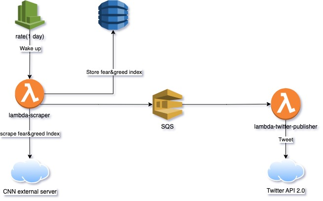
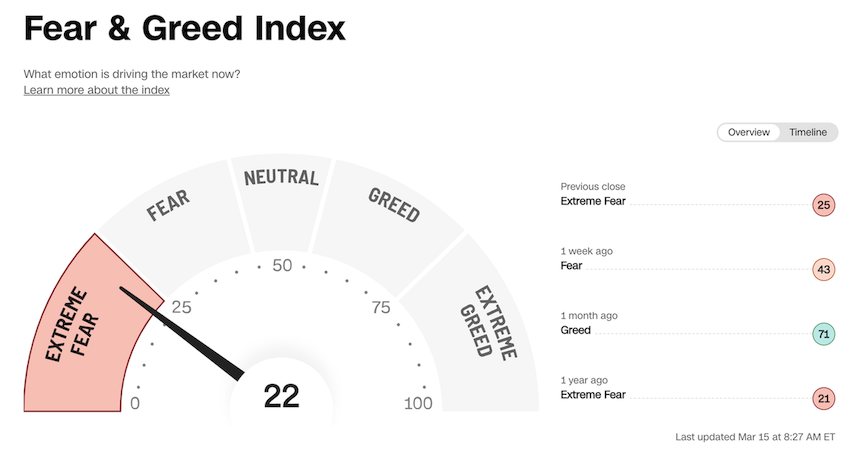

### List of goals to learn
- [X] Terraform: create a couple of lambdas and a SQS queue in between them, also a DynamoDB table to store some data.
- [X] Twitter API: basic usage of the API
- [X] Typescript must be set in the most strict level in `.tsconfig`
- [X] Compile TS project and bundle it to deploy as JS lambda [1]
- [X] Find a good graphical diagram tool
- [X] monorepo management tool: lerna

### Description
The idea is to tweet periodically some information about the Fear&Greed index [1]. To do this a lambda will check every X hours the external resource, scrap the status about this index and send it to a SQS queue and also store it into a DynamoDB table.
A second lambda will be in charge of dealing with the twitter API. As soon as any message arrives to the SQS queue it will pusblish it in a new tweet.


<b>[1]</b> https://edition.cnn.com/markets/fear-and-greed


[1] After trying different solutions for sending the TS project to lambda once its transpiled into JS I came into the conclusion that the best tool is esBundle.js (https://esbuild.github.io/)
I tried webpack but it is a much complex configuration and the uglification of the code changes the structure of the code too much, so lambda can not find the name of the lambda. I didnt
want to use SLS or AWS SAM for this cause I want to do it all from terraform. Also esBundle transpiles all TS into one single JS that I did not uglified, so its readable. A much more efficient
way of bundling would be the following, but code is less readable and for debugging purposes I wanted to keep it easy.
```"build": "esbuild index.ts --bundle --minify --sourcemap --platform=node --target=es2020 --outfile=dist/index.js",```

### About Fear and Greed index



`What is the CNN Business Fear & Greed Index?`

The Fear & Greed Index is a way to gauge stock market movements and whether stocks are fairly priced. The theory is based on the logic that excessive fear tends to drive down share prices, and too much greed tends to have the opposite effect.

`How is Fear & Greed Calculated?`

The Fear & Greed Index is a compilation of seven different indicators that measure some aspect of stock market behavior. They are market momentum, stock price strength, stock price breadth, put and call options, junk bond demand, market volatility, and safe haven demand. The index tracks how much these individual indicators deviate from their averages compared to how much they normally diverge. The index gives each indicator equal weighting in calculating a score from 0 to 100, with 100 representing maximum greediness and 0 signaling maximum fear.

`How often is the Fear & Greed Index calculated?`

Every component and the Index are calculated as soon as new data becomes available.

`How to use Fear & Greed Index?`

The Fear & Greed Index is used to gauge the mood of the market. Many investors are emotional and reactionary, and fear and greed sentiment indicators can alert investors to their own emotions and biases that can influence their decisions. When combined with fundamentals and other analytical tools, the Index can be a helpful way to assess market sentiment.
### Lerna management orders

>> npx nx graph // To visualize the project structure
>> npx lerna run build // To build the whole project (from root)
>> npx lerna run test // To test the project (each package)
#### Bibliography: 

- https://registry.terraform.io/providers/hashicorp/aws/latest/docs // Official documentation of AWS provider in terraform
- https://www.middlewareinventory.com/blog/aws-lambda-terraform/
- https://dev.to/aws-builders/how-to-schedule-the-execution-of-your-lambda-code-2fl3#:~:text=The%20execution%20of%20a%20Lambda,a%20source%20to%20a%20destination.
- https://docs.aws.amazon.com/lambda/latest/dg/typescript-package.html#aws-cdk-ts
- https://esbuild.github.io/
- https://lerna.js.org/docs/getting-started